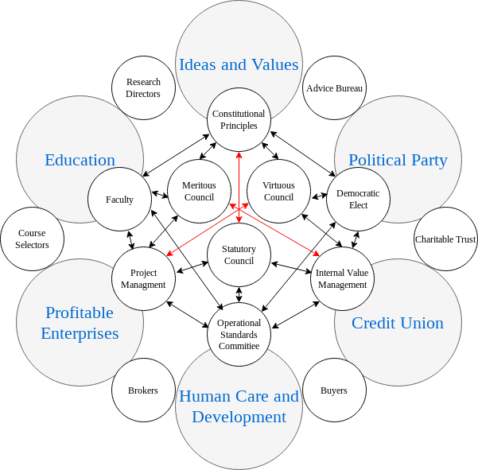

# Introduction

Propolis integrates work, education, ideals and values, politics, social 
services and financial services plus related activities and processes with 
a focus on interoperation of these elements to achieve progressive outcomes 
for people. 

## Operating Paradigm

Importantly, Propolis seeks to operate **alongside or inside** extant 
organisations or systems but to have the capability of integrating those 
organisations as nodes within Propolis or replacing those systems entirely.

Procedures and protocols for engagement and communication must therefore be 
specified. The open source nature of the organisation should ensure these 
are ethically derived but to ensure the fluidity of intersectional decision 
making a robust yet greatly reduced set of fundamental instructions (laws) 
should be implemented with guidance emerging from the discourse of 
qualified councils or ethics committees.

## Core Design Principles

### Decentralisation

Propolis should be implemented in the most decentralised way possible to 
remain agile and active yet must simultaneously be consistent and unified 
in its approaches. Some committees may need to remain standing to maintain 
the core procedures/protocols but others may be formed and dissolved as 
necessary.

### Member Well-being First

The main goal of Propolis is to improve the quality of life, stability and 
social cohesion of its members and to the communities it interacts with. 

Any protocols enacted should be:
- Reactive to the real states people are naturally in
- Not driven towards targets that benefit the organisation at the expense 
of individuals
- Minimalistic and ethically driven
- Not benefiting the rights/freedoms/responsibilities of one individual 
over another

The safeguarding of the well-being of Propolis members is a priority 
concern and should be reflected in any activity or decision.

### Resilience

The protocols and procedures should mimic those found in computer networks 
and systems in that they should remain in operation even if certain nodes 
or connections become inoperative.

### Modularity

Where possible the procedures and practices we develop should be operable 
as stand alone functionality that existing organisations can adopt either 
autonomously or under guidance - either to improve their own internal 
efficiency or in order to interface/integrate/reorganise into a Propolis 
like organisational structure.

## For the Typical Member

The operation of Propolis on a basic level from the standpoint of a typical 
member could be seen as a **social hub for businesses, entrepreneurs and 
workers** to engage cooperatively in novel ways within an overarching 
structure that removes many of the hurdles that can stand in the way of 
such interactions and activities while at the same time offering tremendous 
benefits that would not otherwise be available.

### Key Benefits

Such benefits would resemble those enjoyed by larger organisations but not 
be limited to them as profits are redirected back into the organisation 
allowing for a broader scope in initiatives. The member would have access 
to these initiatives while maintaining their ultimate autonomy.

**Core initiatives include:**

- **Worker-jobs pool** - Connect talent to projects (models exist in 
fisheries employment practices and modern freelance platforms)
- **Accommodation and utilities assistance** - Holistic support to reduce 
individual member stress
- **Advanced resource sharing network** - Between members to reduce costs 
and increase efficiency

## Organisational Structure

The complete Propolis organisation consists of:

- **Six main departments** - All stand alone organisations that cooperate 
internally
- **Satellite agencies** - Each main department influences two adjacent 
satellites
- **Management committees** - Coordinate department activities
- **Governing councils** - Provide oversight and strategic direction

Communication flows both directly between departments and via internal 
councils and external satellite proxies as needed.

*Figure 1: A conceptual map of Propolis outlining the major organisational 
components, satellite agencies, management committees and governing 
councils. Black arrows show expected necessary communication, red arrows 
show urgent communication.*
